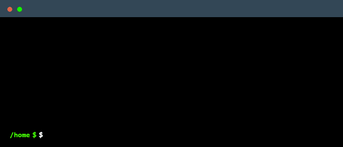

🔭 I’m currently working on **Python and Web Development projects**

## 💻 Tech Stack

**🧠 Programming Languages**  
    

**🌐 Web Development**  
       

**🗄️ Databases**  
  

**☁️ Cloud & Deployment**  
    

**📊 Python Libraries**  
 

**🧰 Tools & Platforms**  
 

**🎨 Design & Creative Tools**  
      

## 📊 GitHub Stats

<table>
<tr>
<td>

</td>
<td>

</td>
</tr>

<tr>
<td colspan="2" align="center">

</td>
</tr>
</table>

